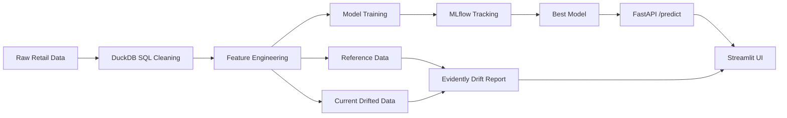

# Retail Demand Forecasting MLOps System

An end-to-end retail demand forecasting project built using messy transactional retail data. The system uses DuckDB SQL for cleaning and feature engineering, MLflow for experiment tracking, FastAPI for model serving, Evidently for drift monitoring, Streamlit for the frontend, and Docker Compose for containerized execution. 

## Live Deployment

- Streamlit app: [Add your Streamlit URL here](https://retail-demand-forecasting-system-dwrveyb8hswekwjbyh7oez.streamlit.app/)
- FastAPI API docs: [Add your Render docs URL here](https://retail-demand-forecasting-system-7v3n.onrender.com/docs)
- FastAPI predict endpoint: `https://your-fastapi-service-url/predict`

These links make it easy for reviewers to test both the frontend and the deployed backend directly.

## Overview

This project forecasts daily retail demand from real-world transactional data and demonstrates a complete MLOps workflow from raw data ingestion to live model serving and drift monitoring. The goal was to build something closer to a production-ready ML system rather than only training a model in a notebook. 

## Dataset

The project uses the **UCI Online Retail** dataset, which contains raw transaction-level retail data. The data is cleaned and aggregated into daily demand using DuckDB SQL, and forecasting features such as lag values, rolling averages, and calendar features are engineered for model training. 

## Pipeline

- Clean messy retail transactions using DuckDB SQL
- Aggregate data to daily demand level
- Engineer lag, rolling, and calendar features
- Train and compare Linear Regression, XGBoost, and Prophet
- Track experiments and metrics with MLflow
- Serve the best model through FastAPI
- Simulate drift and generate an Evidently report
- Expose predictions and monitoring through Streamlit

This modular workflow reflects common MLOps practices where data preparation, training, serving, and monitoring are treated as separate stages. 

## Architecture



## Model Comparison

| Model | MAE | RMSE | Notes |
|---|---:|---:|---|
| Linear Regression | 11.63 | 35.67 | Baseline |
| XGBoost | 3.06 | 20.02 | Best-performing model |
| Prophet | 10505.95 | 15297.98 | Time-series benchmark |

The model comparison shows why experiment tracking matters: a simple baseline provides a reference point, while XGBoost performed best on the engineered feature set. 

## Project Structure

```bash
.
├── data/
│   ├── raw/
│   ├── processed/
│   └── monitoring/
│       ├── reference.parquet
│       └── current.parquet
├── mlruns/
├── models/
├── reports/
├── src/
│   ├── api/
│   │   └── app.py
│   ├── data/
│   ├── features/
│   ├── ingest/
│   ├── train/
│   └── ui/
│       └── streamlit_app.py
├── docker-compose.yml
├── Dockerfile.api
├── Dockerfile.streamlit
├── requirements.txt
└── README.md
```

## Run Locally

Install dependencies:

```bash
pip install -r requirements.txt
```

Run the pipeline and train models:

```bash
python -m src.ingest.download_data
python -m src.data.run_duckdb_pipeline
python -m src.features.make_train_test_split
python -m src.train.train_linear
python -m src.train.train_xgboost
python -m src.train.train_prophet
```

## Start MLflow

```bash
mlflow ui --backend-store-uri sqlite:///mlflow.db
```

## Start FastAPI

```bash
uvicorn src.api.app:app --reload
```

## Start Streamlit

```bash
streamlit run src/ui/streamlit_app.py
```

## Docker

Run the frontend and backend together with Docker Compose:

```bash
docker compose build
docker compose up
```

Then open:

- FastAPI docs: `http://localhost:8000/docs`
- Streamlit UI: `http://localhost:8501`

Using separate Streamlit and FastAPI services with Docker Compose is a practical deployment pattern for ML applications with a UI and backend API. 

## Monitoring

The project includes data drift monitoring using Evidently. A drifted “current” dataset is simulated from the processed feature data, compared against reference data, and rendered as a visual report directly inside the Streamlit app.

### Monitoring files used

The live drift report uses:

- `data/monitoring/reference.parquet`
- `data/monitoring/current.parquet`

These files are required for the monitoring section in the deployed Streamlit app.

## API Example

Example request to the deployed prediction endpoint:

```bash
curl -X POST "https://your-fastapi-service-url/predict" \
  -H "Content-Type: application/json" \
  -d '{
    "daily_revenue": 500.0,
    "avg_unit_price": 5.0,
    "is_weekend": 0,
    "day_of_week": 2,
    "month": 6,
    "week_of_year": 24,
    "lag_1": 95.0,
    "lag_7": 100.0,
    "rolling_mean_7": 98.5,
    "rolling_sum_7": 690.0
  }'
```

## Deployment Notes

- FastAPI is deployed separately from Streamlit.
- Streamlit calls the live FastAPI `/predict` endpoint instead of `localhost`.
- The drift report is generated live in the Streamlit UI from the monitoring parquet files.
- Monitoring files must be available in the deployed repository for the drift section to work correctly.

## Future Improvements

- CI/CD with GitHub Actions
- Cloud deployment for API and frontend
- Automated retraining
- MLflow registry promotion workflow
- More advanced retail features and hierarchical forecasting

## License

MIT License

## Contact

**Shrivallabha Patil**  
Guildford, England, UK

- GitHub: [https://github.com/vallabh-12](https://github.com/vallabh-12)
- LinkedIn: [https://www.linkedin.com/in/shrivallabha-patil/](https://www.linkedin.com/in/shrivallabha-patil/)
